# setup-guide

## Jenkins Controller Configuration

When you open http://localhost:8080, you will see the initial password setup screen as shown below.

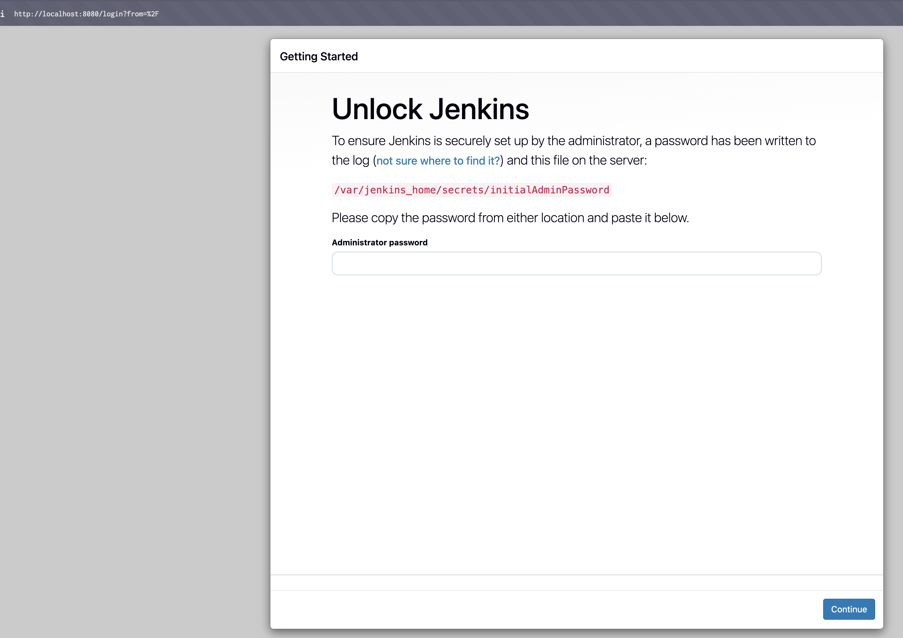

You can check the initial Admin password with the following command.
Enter the displayed password.

```sh
cat jenkins-controller-data/secrets/initialAdminPassword
```

After that, proceed as follows:

- Install suggested plugins
- Create First Admin User
  - Enter your preferred Admin User and Password
  - 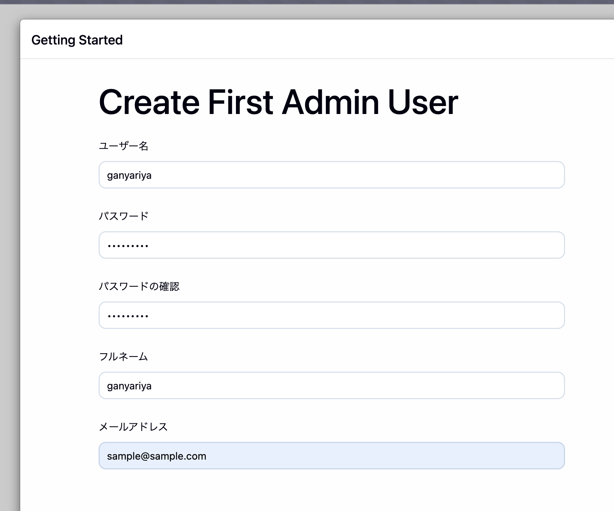
- Instance Configuration
  - Leave the `Jenkins URL` as `http://localhost:8080/` and click `Save And Finish`
- Complete
  - If you see a screen like this, setup is complete
  - 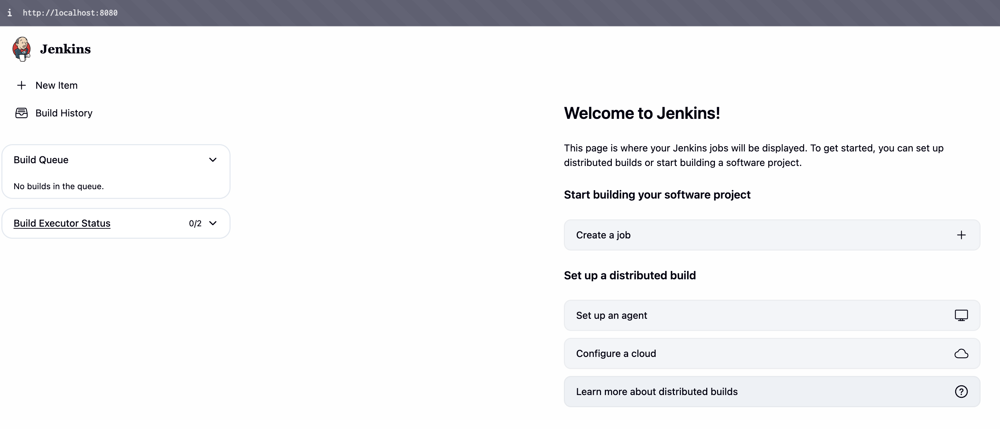

## SSH Agent Configuration

Now let's create an SSH Agent Node and configure it to be used as a node for pipeline execution.

Select `Manage Jenkins > Nodes > +New Node`.
Then set a Node name for the SSH Agent Node and create it as a Permanent Node.
In this example, we'll name it `jenkins-ssh-agent1-node`.

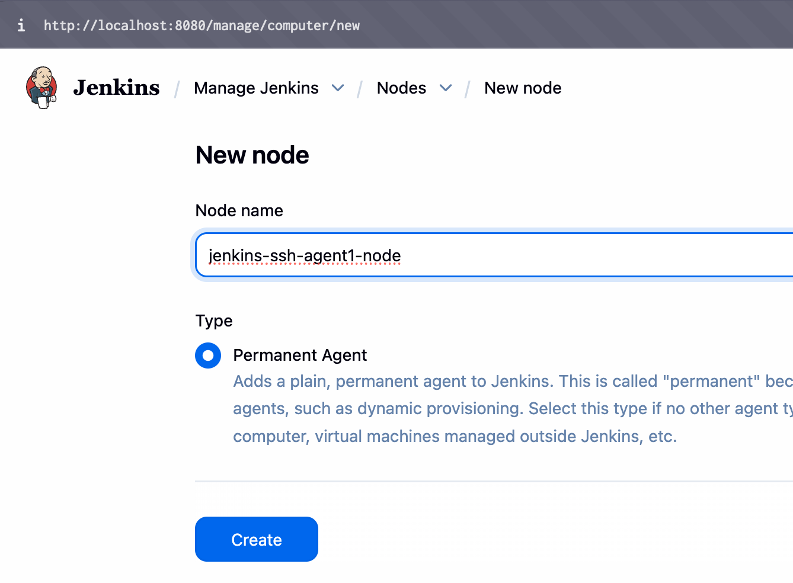

First, configure everything **except Credentials**.

- `Number of executors`
  - The number of builds that can be executed in parallel on this node
  - You can set it to a number greater than 1, such as `2`
- `Remote root directory`
  - Always specify `/home/jenkins/agent`
- Labels
  - The label you specify here will be used in the `agent` clause of your Pipeline
  - In this example, we're using `jenkins-ssh-agent1-label`
- Launch method
  - `Launch agents via SSH`
  - Host
    - Specify `jenkins-ssh-agent1`
    - Use the same service name as in compose.yml
  - `Host Key Verification Strategy`
    - `Non Verifying Verification Strategy`

```yaml
  jenkins-ssh-agent1: # Set this in Launch method > Host
    <<: *jenkins-ssh-agent-definition
```

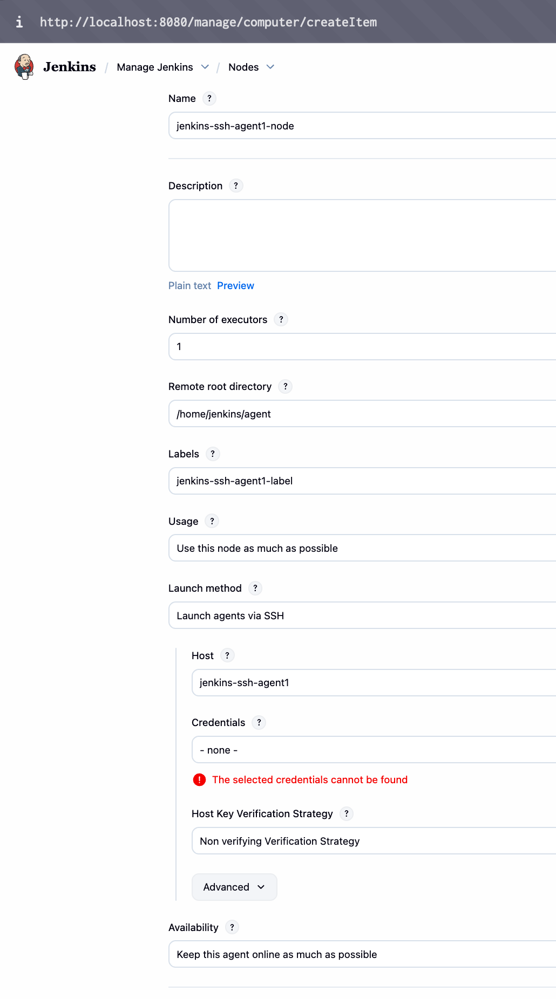

Once you've specified these settings, press the `Credentials > Add` button to register the authentication information for SSH connection.

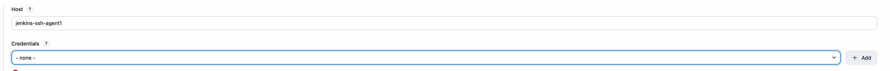

- Kind
  - `SSH Username with private key`
- ID
  - `jenkins-ssh-agent1-ssh-key`
  - Enter any ID you like
- Username
  - Always enter `jenkins`
- Private Key
  - Copy and paste the contents of `jenkins_ssh_agent_key` generated by `generate_ssh_key.sh`
- Passphrase
  - Leave this empty

After filling in the above, create this credential.

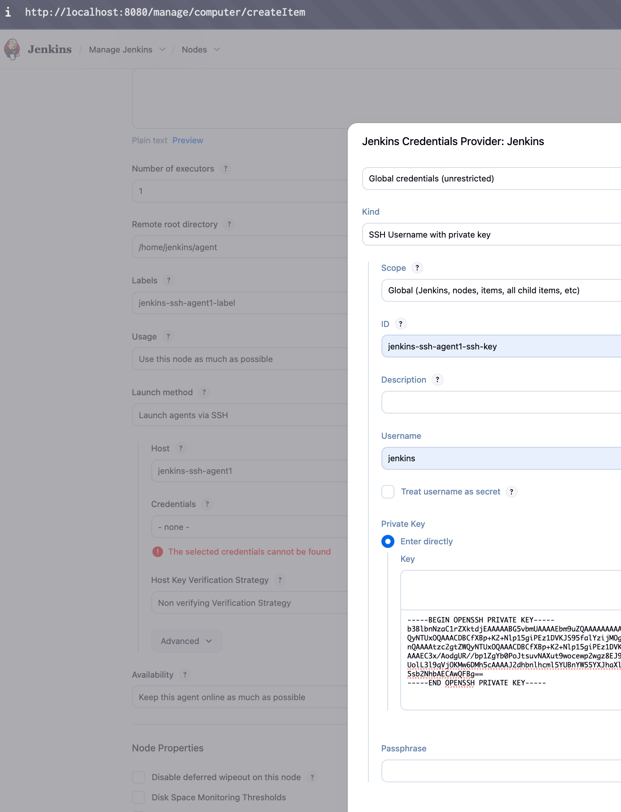

Then, configure the newly created credential as shown below and Save.

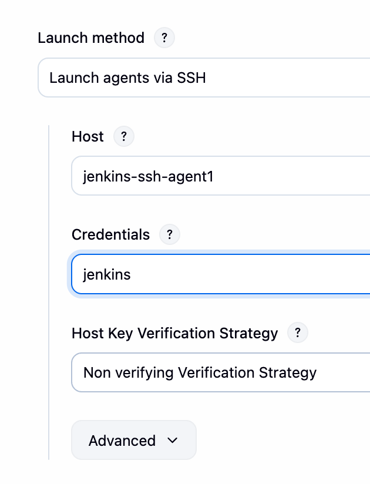

Open the created jenkins-ssh-agent1-node, and if it looks like the following, the SSH connection is successful.

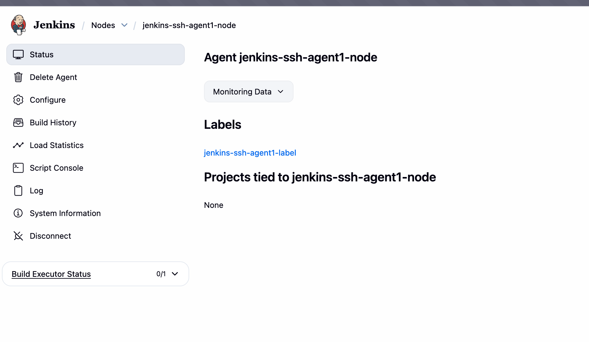
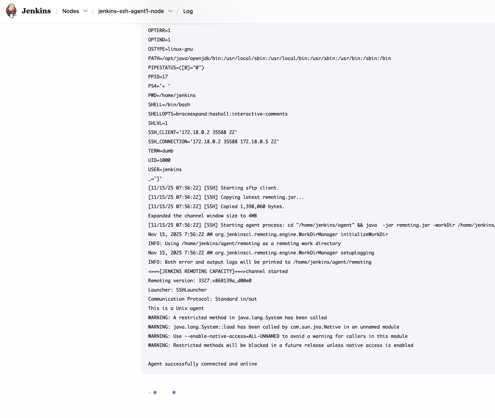

To verify that it's working, let's run a simple sample pipeline.
Create a new `Pipeline` called `TestJob`.

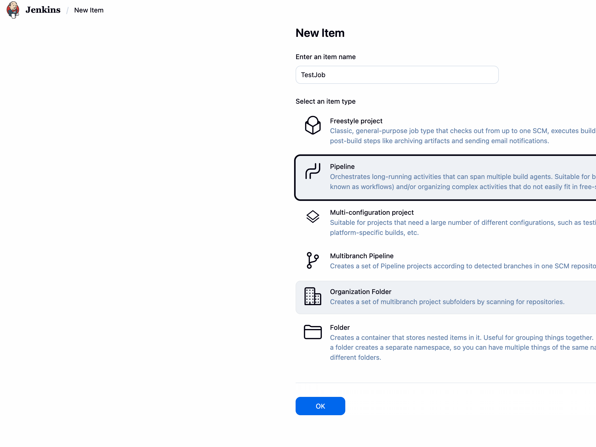

```groovy
pipeline {
    agent any

    stages {
        stage('Checkout Source') {
            steps {
                git branch: 'main', url: 'https://github.com/ganyariya/ganyariya.git'
                sh 'ls -a'
            }
        }

        stage('docker build and test') {
            agent {
                docker {
                    image 'node:lts-alpine'
                }
            }
            steps {
                sh 'echo "--- Inside Docker Container ---"'
                sh 'ls -a'
                sh 'node -v'
            }
        }
    }
}
```

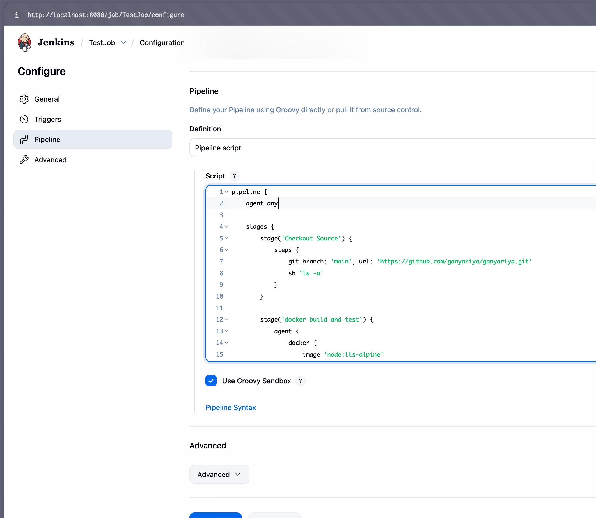

Run the `TestJob` created above several times, and if jobs can be executed correctly on both `jenkins-ssh-agent1-node` and `Built-in Node (master)`, everything is working properly.

You can create `jenkins-ssh-agent2-node` for the jenkins-ssh-agent2 service using the same procedure.

```yaml
  jenkins-ssh-agent2:
    <<: *jenkins-ssh-agent-definition
```

### Explanation of How SSH Agent Works

As a supplement, let me explain how the SSH Agent works as a Pipeline Agent.

`generate_ssh_agent_key` generates:

- private key: `jenkins_ssh_agent_key`
- public key: `jenkins_ssh_agent_key.pub`

Additionally, an `.env` file is created, and the public key environment variable is set like `JENKINS_AGENT_SSH_PUBKEY=ssh-ed25519 AAAAC3...`.

When running `docker compose up -d`, the public key is passed to the `jenkins/ssh-agent` image container and automatically written to `/home/jenkins/.ssh/authorized_keys`.

```yaml
  environment:
    # jenkins/ssh-agent container automatically registers JENKINS_AGENT_SSH_PUBKEY to `/home/jenkins/.ssh/authorized_keys` on startup
    JENKINS_AGENT_SSH_PUBKEY: ${JENKINS_AGENT_SSH_PUBKEY}
```

Then, the `jenkins-ssh-agent1-node` node configured in the Jenkins Web Console uses the Private Key to request an SSH connection to the host `jenkins-ssh-agent1`.
Since `jenkins-ssh-agent1` has the public key registered via `JENKINS_AGENT_SSH_PUBKEY: ${JENKINS_AGENT_SSH_PUBKEY}`, it accepts the SSH connection request and subsequent SSH connections work correctly.

## Inbound TCP/WebSocket Agent Configuration

For Inbound Agents, preliminary work on the Jenkins Web Console side is required.
Let's create a node called `jenkins-inbound-agent1-node`.

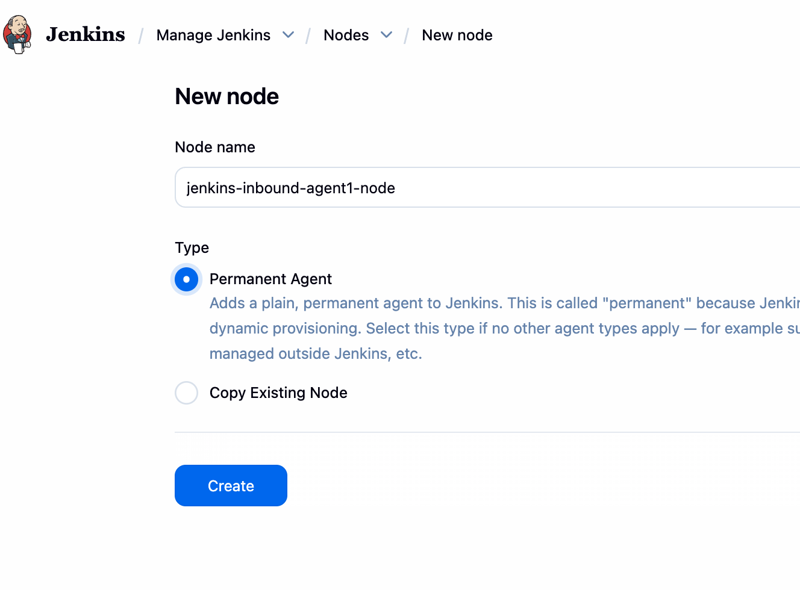

Configure it as shown in the image below.
Unlike SSH Agent, select `Launch agent by connecting it to the controller` for `Launch method`.

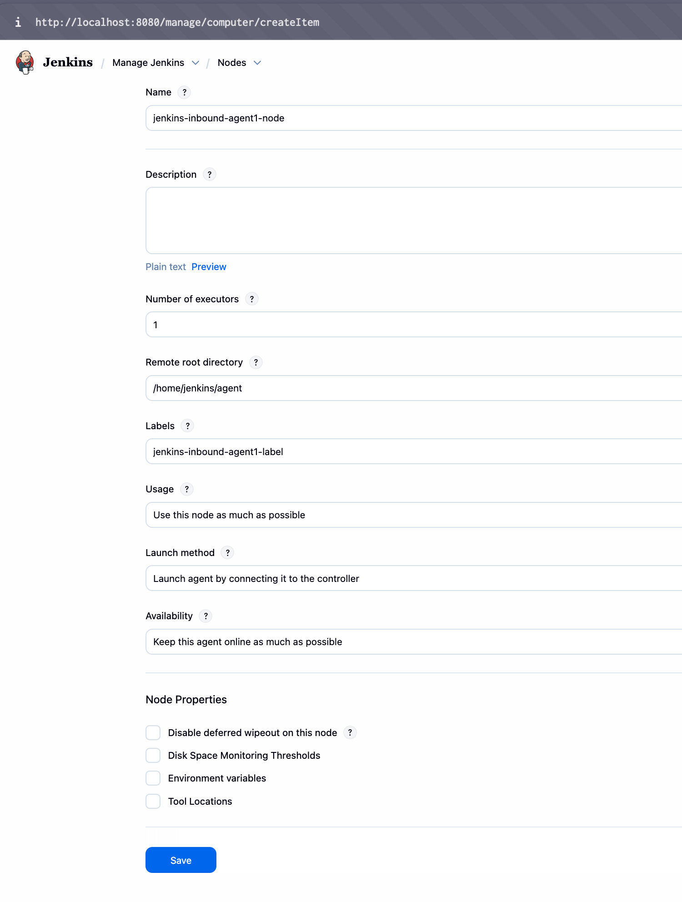

When you open `jenkins-inbound-agent1-node`, you'll see a connection command in the following format.
When you run this command in the shell of the machine you want to be an Agent, it sends a request to the Jenkins Controller saying "I want to work as your Jenkins Agent. Please register me as an Agent. Here's my secret and name for identification."
The Jenkins Controller will register it as an Agent if the secret and name are correct.

However, since we're using the `jenkins/inbound-agent` image, we won't run the command below.
Instead, we'll register this information as environment variables for the docker compose service, and the inbound-agent container will automatically connect.

```bash
curl -sO http://localhost:8080/jnlpJars/agent.jar
java -jar agent.jar -url http://localhost:8080/ -secret JENKINS_SECRET -name JENKINS_AGENT_NAME -webSocket -workDir "/home/jenkins/agent"
```

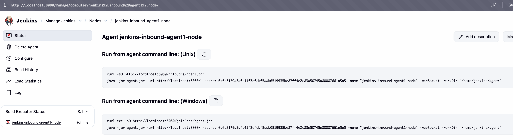

Set your `.env` file as follows:

```env
JENKINS_AGENT_SSH_PUBKEY=ssh-ed25519 AAAA...
JENKINS_INBOUND_AGENT1_SECRET=0b6c317...
JENKINS_INBOUND_AGENT1_NAME=jenkins-inbound-agent1-node
```

By setting these .env variables, they are passed to the inbound-agent container through the environment variables in compose.yml.

```yaml
      # curl -sO http://localhost:8080/jnlpJars/agent.jar java -jar agent.jar -url http://localhost:8080/ -secret JENKINS_INBOUND_AGENT1_SECRET -name JENKINS_INBOUND_AGENT1_NAME -webSocket -workDir "/home/jenkins/agent"
      # You need to specify the same `-secret` and `-name` arguments as the like above command, shown under `Run from agent command line: (Unix)` on the Jenkins Web Console node status page
      JENKINS_SECRET: ${JENKINS_INBOUND_AGENT1_SECRET}
      JENKINS_AGENT_NAME: ${JENKINS_INBOUND_AGENT1_NAME}
```

To apply the environment variables, run the following command to recreate the containers:

```bash
docker compose down -v && docker compose up -d
```

After restarting, if `jenkins-inbound-agent1-node` shows `Agent is connected`, everything is working correctly.
Run `TestJob` again to verify that the job executes properly.

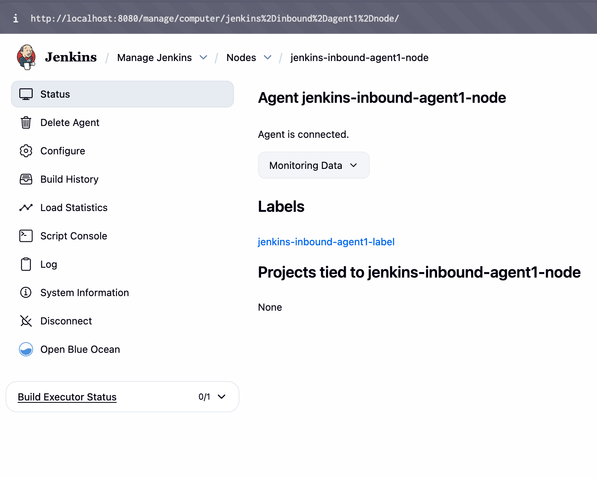